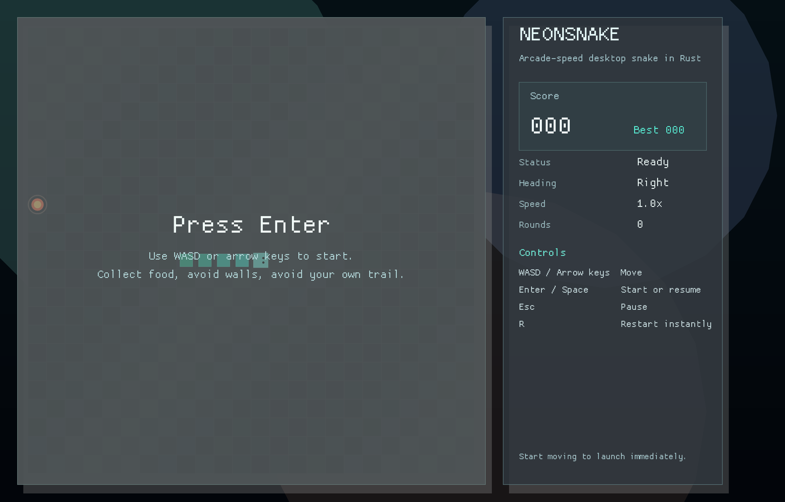
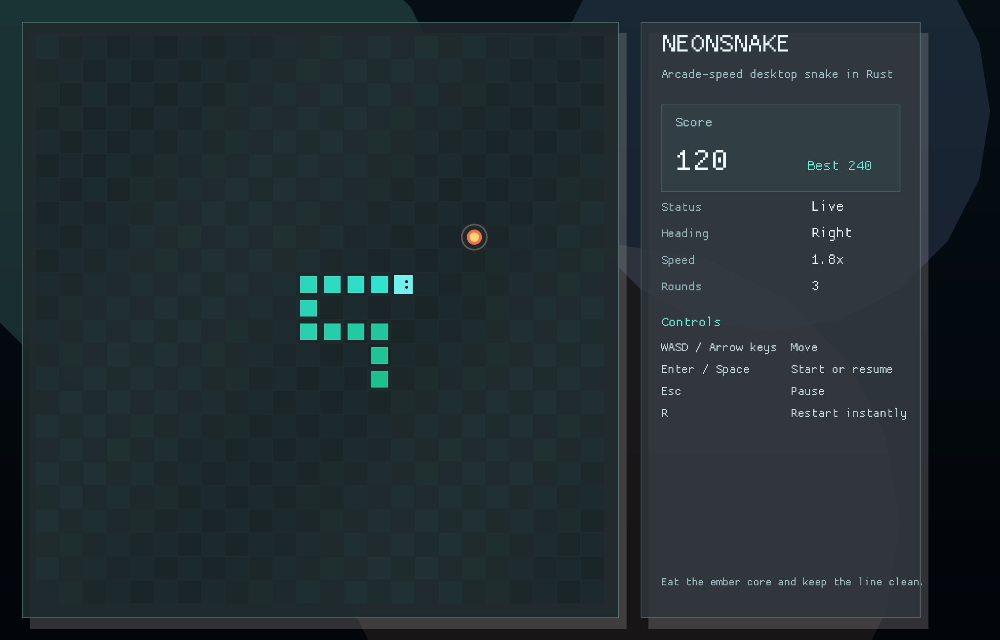
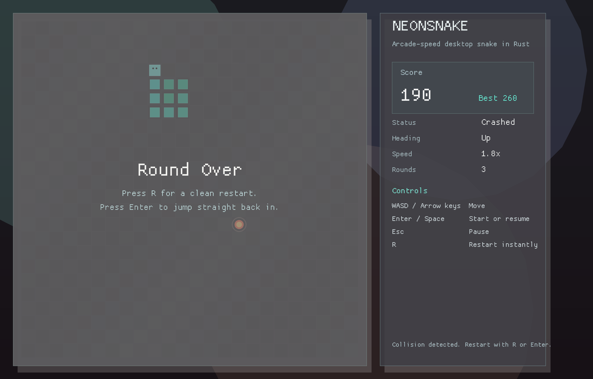

# NeonSnake

NeonSnake is a desktop Snake game written in Rust with `macroquad`. The goal was simple: keep the classic rules intact, but give the game a cleaner arcade presentation with a responsive layout, a proper HUD, and just enough motion to make it feel alive on a modern desktop.

## What it includes

- Responsive desktop window with a dedicated game board and side panel
- Bomb hazards that end the run on contact
- Smooth neon-inspired visual style
- Procedural audio: looping background music plus key, food, bomb, and game-over cues
- Start, pause, restart, and game-over states
- Score tracking, best score tracking, and speed ramping as you play
- Keyboard controls that feel immediate and predictable

## Screenshots

### Title Screen



### Gameplay



### Game Over



## Running the game

### Prerequisites

- Rust stable toolchain
- Cargo

This project was built and tested with Rust `1.94.0`.

### Start in development mode

```bash
cargo run
```

### Build an optimized release binary

```bash
cargo build --release
```

The release executable will be available at:

```text
target/release/neonsnake
```

## Controls

- `WASD` or arrow keys: move
- `Enter` or `Space`: start / resume
- `Esc`: pause
- `R`: restart the current run

## Project structure

```text
.
├── Cargo.toml
├── README.md
├── docs/
│   └── screenshots/
│       ├── game-over.png
│       ├── gameplay.png
│       └── title.png
└── src/
    └── main.rs
```

## Notes

The game is intentionally self-contained. There are no external textures, no asset pipeline, and no extra setup beyond a working Rust toolchain. Clone it, run it, and it works.

## License

Released under the MIT License. See [LICENSE](LICENSE).
